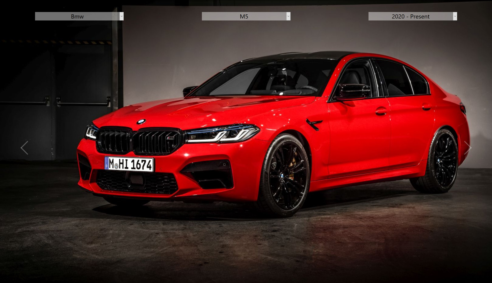
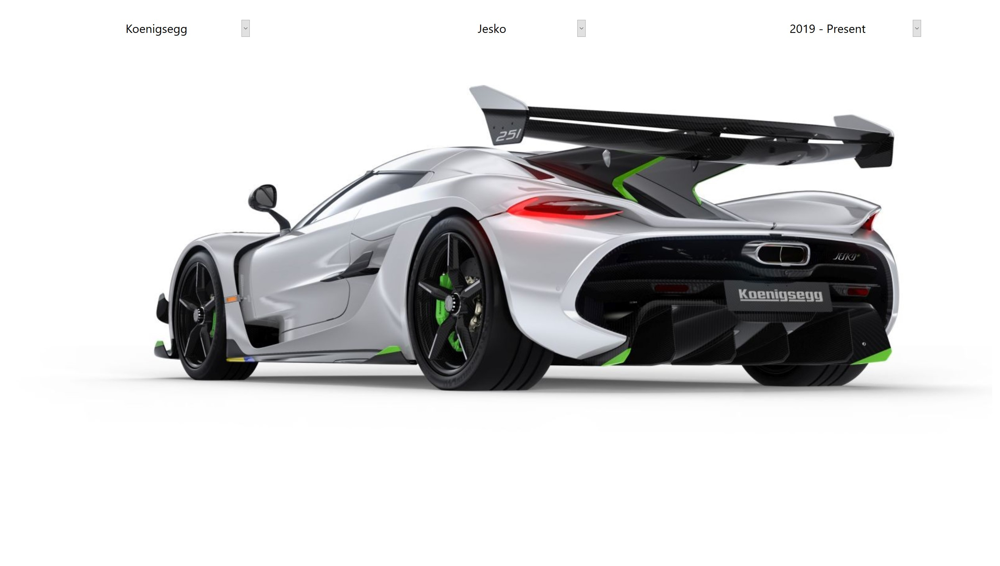
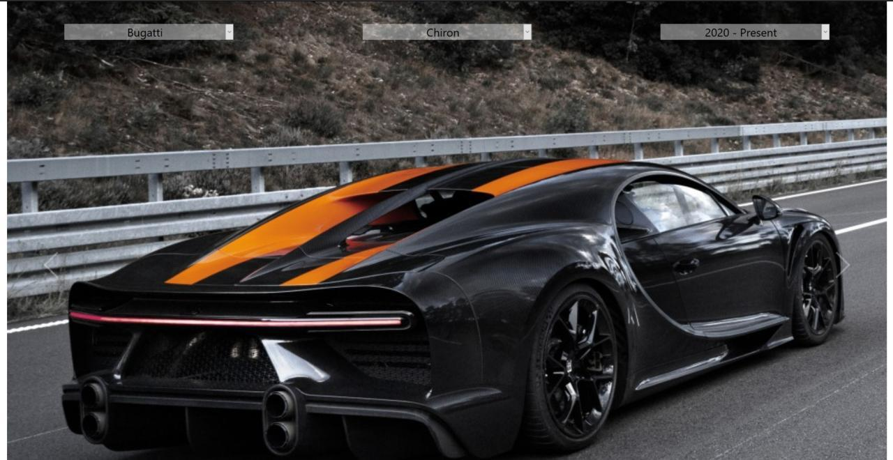

# car-id
REST API built with flask serves data to two React apps. One is a gallery that requests user input and displays a slideshow of the specific car, the other uses machine learning to predict the car based on an image.

